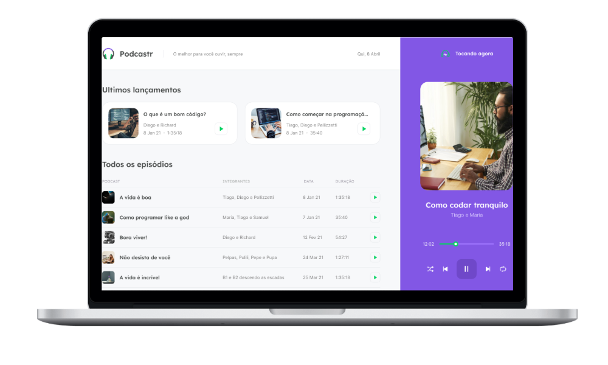

<div align="center">
    
</div>

<div align="center">
    <h1> Mantenha-se informado no mundo Dev </h1>
    <a href="https://rocketseat.com.br/" target="_blank">
    
    </a>
    <a href="https://github.com/Pedrovinhas" target="_blank"> </a>
     
     
     
    
</div>

<div align="center">

</div>

## 💻 Projeto
O Podcastr é uma aplicação desenvolvida durante a Next Level Week 5 de React da RocketSeat. Nele podemos escutar nossos podcasts preferidos e acompanhar a postagem de novos. O projeto foi construído ao longo de 5 dias com tecnologias e conceitos mais recentes do desenvolvimento web, usando NextJS e React e fazendo o fetch de uma API fake para trazer novos dados diariamente.

## 📜 Guia Trilha React
<div>
<p>Dia 1 - React e Next.js  </p> 
<p>Dia 2 - Consumindo a API</p> 
<p>Dia 3 - Paginação </p> 
</div>
 
## ⛏ Tecnologias
- [X] TypeScript
- [X] ReactJS
- [X] [Next.js](https://nextjs.org/docs)
### Dependências
- [X] Yarn
- [X] Axios
- [X] JSON Server

```bash
npm run dev
# or
yarn dev
# Open http://localhost:3000 with your browser to see the result.
```

## 📝 License

This project is under the MIT license. See the archive [LICENSE](LICENSE.md) for more details.

---
<blockquote>
    Feito por Pedro Henrique Vinhas 🪐
</blockquote>

